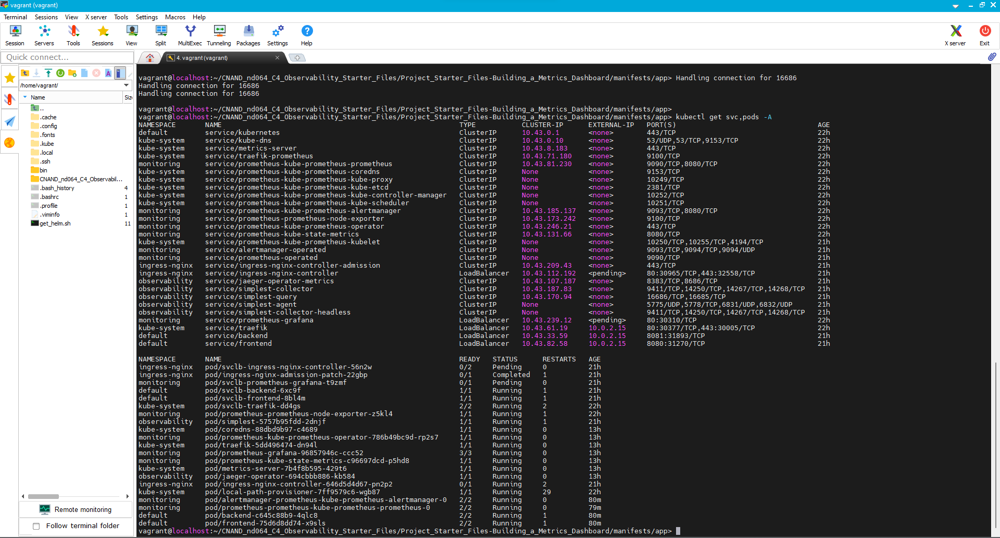
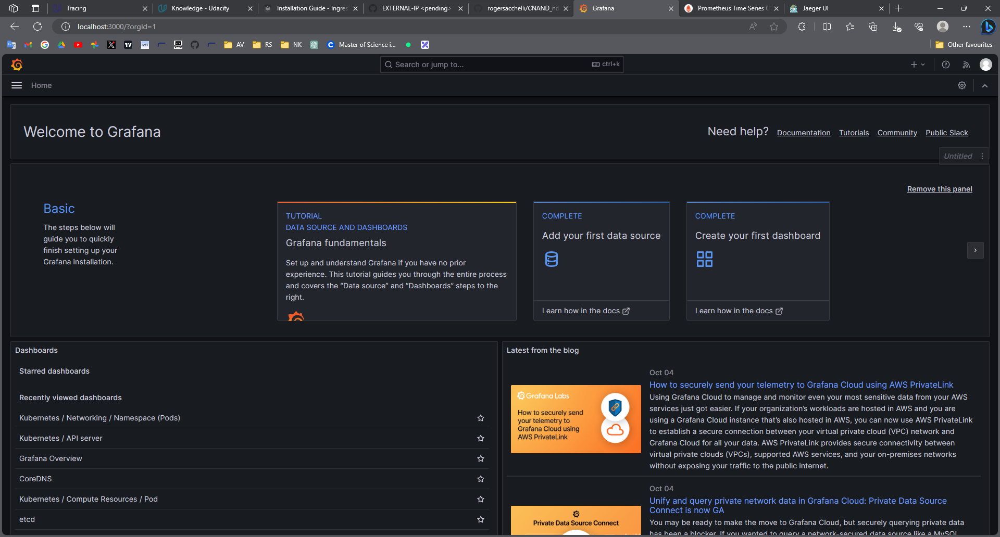
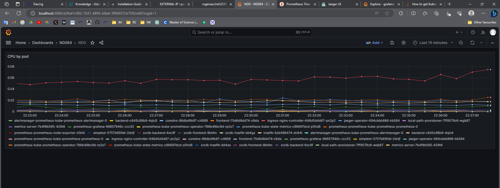
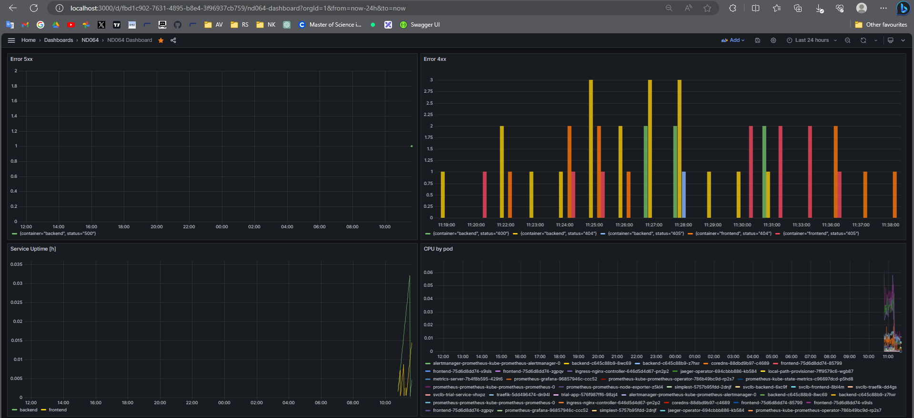
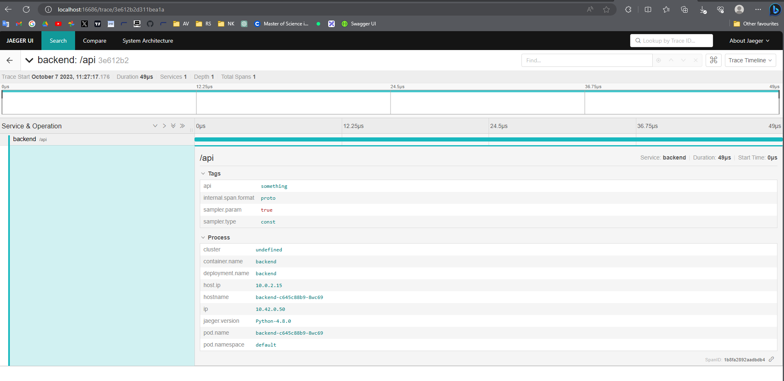
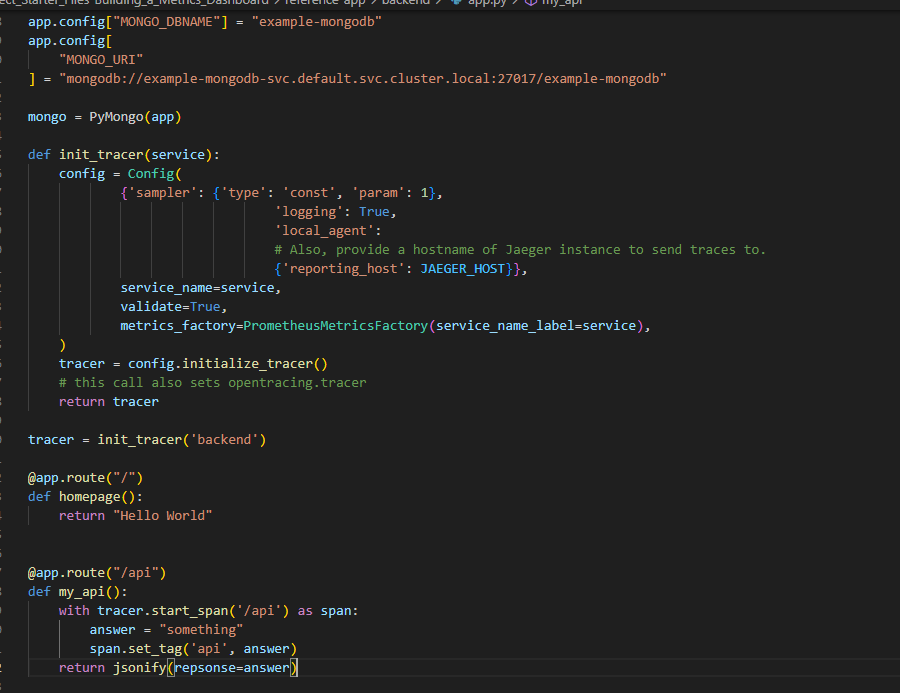
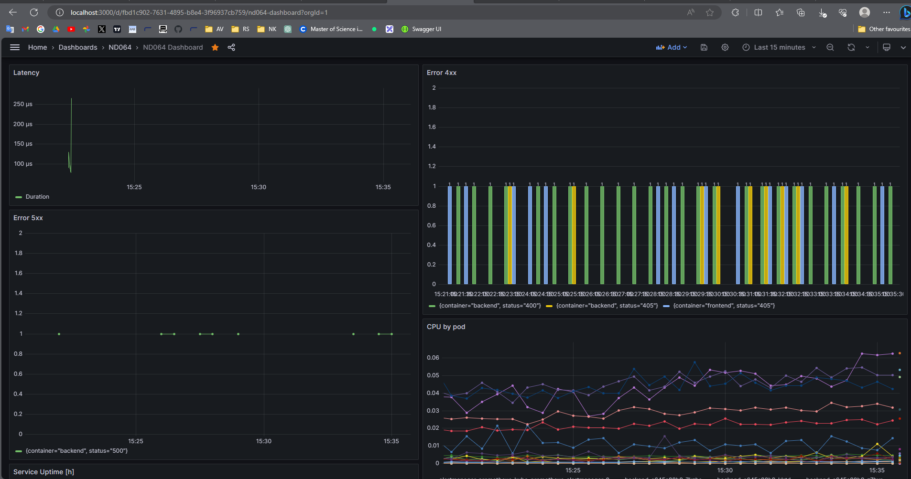
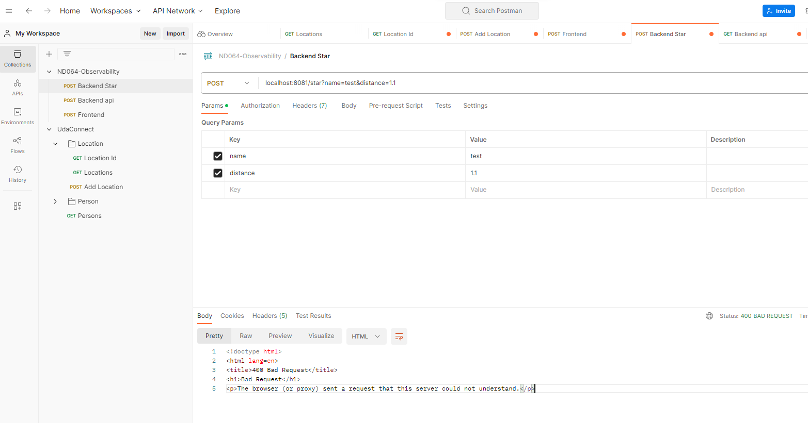
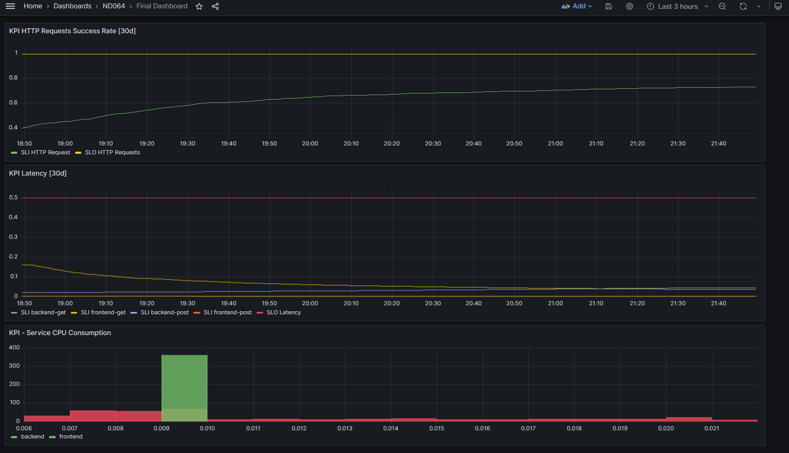

**Note:** For the screenshots, you can store all of your answer images in the `answer-img` directory.

## Verify the monitoring installation

*TODO:* run `kubectl` command to show the running pods and services for all components. Take a screenshot of the output and include it here to verify the installation



## Setup the Jaeger and Prometheus source
*TODO:* Expose Grafana to the internet and then setup Prometheus as a data source. Provide a screenshot of the home page after logging into Grafana.



## Create a Basic Dashboard
*TODO:* Create a dashboard in Grafana that shows Prometheus as a source. Take a screenshot and include it here.



```graphql
sum(node_namespace_pod_container:container_cpu_usage_seconds_total:sum_irate{}) by (pod)
```

## Describe SLO/SLI
*TODO:* Describe, in your own words, what the SLIs are, based on an SLO of *monthly uptime* and *request response time*.

*[Response]: SLI is the measured indicator after observation of the agreed period of the SLO. In the example of monthly uptime, the SLI can indicate 99.8% which yelds 14.4 hours of downtime for 30 days of observation. In the context of request response time, SLI could have indicated an average time of 2ms during peak hour.*

## Creating SLI metrics.
*TODO:* It is important to know why we want to measure certain metrics for our customer. Describe in detail 5 metrics to measure these SLIs. 

<i>[Response]: It's important to measure certain metrics in order to assess if the agreed performance is in accordance to SLOs. Those indicators are used to evaluate if system meets SLAs. We can list as important metrics:

* Latency - Time for requested to be responded.
* Error rate - Ration between 4xx and 5xx responses by 2xx responses.
* Uptime or Availability - Indicates how many hours the service is up.
* Resource Usage - CPU/Memory/IO are important metrics to be measured in order to keep system safe from outages or slowliness.
* Concurrency - Number of users application handles can be a important metric to be veried to check if system is running accordingly to its planning.</i>

## Create a Dashboard to measure our SLIs
*TODO:* Create a dashboard to measure the uptime of the frontend and backend services We will also want to measure to measure 40x and 50x errors. Create a dashboard that show these values over a 24 hour period and take a screenshot.

*Note that an endpoint has been added in order to generate 500 errors on backend*



## Tracing our Flask App
*TODO:*  We will create a Jaeger span to measure the processes on the backend. Once you fill in the span, provide a screenshot of it here. Also provide a (screenshot) sample Python file containing a trace and span code used to perform Jaeger traces on the backend service.






## Jaeger in Dashboards
*TODO:* Now that the trace is running, let's add the metric to our current Grafana dashboard. Once this is completed, provide a screenshot of it here.

*Latency calculated by Jaeger is added*



## Report Error
*TODO:* Using the template below, write a trouble ticket for the developers, to explain the errors that you are seeing (400, 500, latency) and to let them know the file that is causing the issue also include a screenshot of the tracer span to demonstrate how we can user a tracer to locate errors easily.

TROUBLE TICKET

Name: Backend Star Endpoint - Error 400

Date: 07-Oct-2023

Subject: Error 400 for backend /star endpoint

Affected Area: Backend

Severity: Critical

Description: Endpoint is not able to understand requested messages for /star POST messages, returning error 400:




## Creating SLIs and SLOs
*TODO:* We want to create an SLO guaranteeing that our application has a 99.95% uptime per month. Name four SLIs that you would use to measure the success of this SLO.

1. Latency - Total time to respond to requests
2. Reliability - Ratio of Successfull Requests by 4xx or 5xx errors
3. Service Uptime.
4. Service CPU consumption.


## Building KPIs for our plan
*TODO*: Now that we have our SLIs and SLOs, create a list of 2-3 KPIs to accurately measure these metrics as well as a description of why those KPIs were chosen. We will make a dashboard for this, but first write them down here.

1. 99.5% of total http requests are responded in less than 500ms
2. ```graphQL
    sum(increase(flask_http_request_duration_seconds_sum{method="GET",container="backend"}[30d]))/sum(increase(flask_http_request_duration_seconds_count{method="GET",container="backend"}[30d]))  
    ```
3. 99.5% of total http requests have 200 status code
   ```graphQL
   sum(increase(flask_http_request_total{status="200"}[30d]))/sum(increase(flask_http_request_total{}[30d]))
   ```
4. 99.5% of time Sum of PODs CPU consumption are lower than 700m
   ```graphQL
    histogram_quantile(0.995, sum by (service, le) (rate(flask_http_request_duration_seconds_bucket[30d]))) 
    ```

## Final Dashboard
*TODO*: Create a Dashboard containing graphs that capture all the metrics of your KPIs and adequately representing your SLIs and SLOs. Include a screenshot of the dashboard here, and write a text description of what graphs are represented in the dashboard.  



1. KPI HTTP Requests [30d] - Mesures rate of 200 http status codes over total number of requests for period of 30d. SLA is set 99.5%
2. KPI Latency [30d] - Measures latency for http requests over the period of 30 days with a SLA of 500ms.
3. Service CPU Consumption [30d] - Measures percentil histogram of 99.5% for CPU consumption by service with a target of 700m. In the graph we can see that 99.5% of measurements are lower than 0.022. 